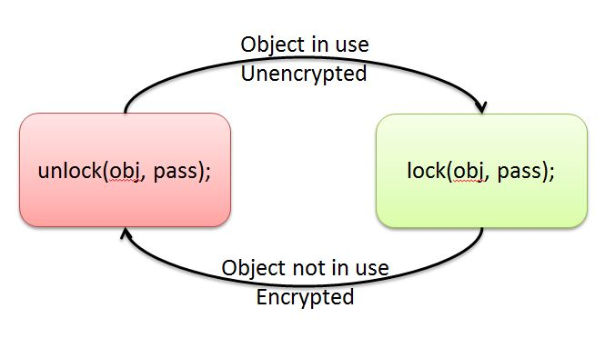
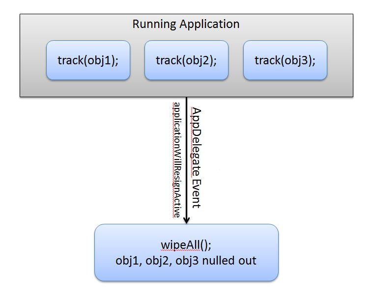
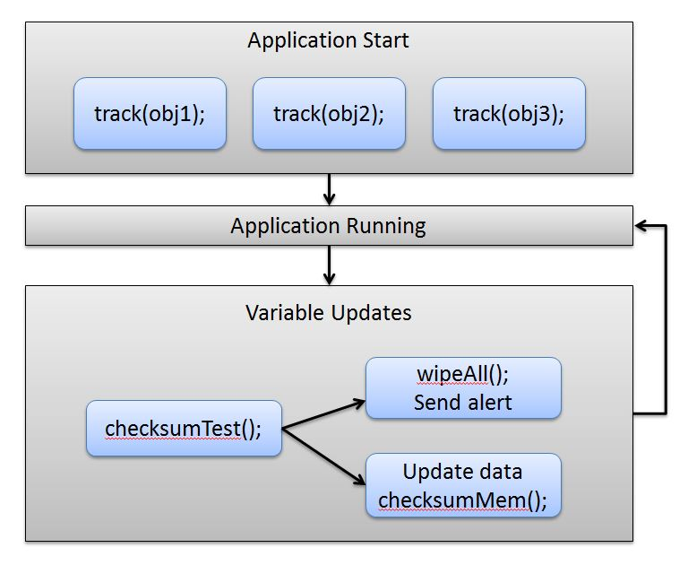

# iMAS Secure Memory[]()

## Background

The "iMAS Secure Memory" framework provides a set of tools for securing, clearing, and validating memory regions and individual variables.  It allows an object to have it's data sections overwritten in memory either with an encrypted version or null bytes.

## Vulnerabilities Addressed

 * CWE-316: Cleartext Storage of Sensitive Information in Memory
 * CWE-244: Improper Clearing of Heap Memory Before Release

## Installation


```
    cd ~/Documents/code/YourApp

    git clone https://github.com/project-imas/memory-security.git
```
  * Click on the top level Project item and add files ("option-command-a")
  * Navigate to **memory-security**, highlight **IMSHandler**, and click **Add**
  * In any file you'd like to use the memory manager import IMSMemoryManager.h:
```objc
   #import "IMSMemoryManager.h"
```

## API
```
  // Find the data portion of the object's memory and zero it out
  wipe(NSObject* obj); 
 
  // Encrypt an object's data in memory with a given password
  lock(NSObject* obj, NSString* pass); 
  
  // Decrypt an object's data in memory with a given password
  unlock(NSObject* obj, NSString* pass); 
  
  // Provide a string with the memory address and checksum of the object
  checksum(NSObject* obj);
  
  // Add the object to a pointer list that wipeAll, lockAll, unlockAll, and checksum operations effect
  track(NSObject* obj);
  
  // Remove the object from the tracked list
  untrack(NSObject* obj);
  
  // Wipe all tracked objects
  wipeAll();
  
  // Lock all tracked objects with the provided password
  lockAll(NSString* pass);
  
  // Unlock all tracked objects with the provided password
  unlockAll(NSString* pass);
  
  // Provide and statically stores a string off all tracked memory addresses and object checksums
  checksumMem();
  
  // Test whether the current memory state of all tracked objects matches the state it was in when checksumMem was called
  // YES if checksums matched, NO otherwise
  checksumTest();
  
  // Encrypt a primitive C type or struct
  lockC(void* obj, int size, char* pass);
  
  // Decrypt a primitive C type or struct
  unlockC(void* obj, int size, char* pass);
  
  // Track function address for validity checking
  validateTrack(void* foo);
  
  // Check function for address/offset validity
  validateCheck(void* foo);
  
  // returns IMP type function pointer to the implementation of an objc NSObject selector to use with validate checking
  objcFuncPtr(const char* cls, const char* sel);
``` 

## Caution on password usage

Note that the included demo application uses a hardcoded string for passwords, this severely weakens the security provided.  For the sake of showing just the functions provided by memory-security without additional dependencies a realistic option was avoided.

For a viable way to store application passwords look into the [Secure Foundation](https://github.com/project-imas/securefoundation) project, which provides access to the device's keychain.

Also to increase overall security any password passed to lock/unlock should have wipe() ran on it immediately after use (As shown in the second part of the first use case). 

## Use case 1: Sensitive variable clearing

Suppose we have a variable that contains sensitive data, we want to limit it's time in memory so that if an attacker gets access to the program's runnign memory they have less chance of seeing it. One strategy is to immediately wipe an object's memory right after use:

```
   NSString* sensitiveData;
   // Processing of sensitive data
   wipe(sensitiveData);
```

This ensures that the data is only in memory during the processing.  


Similarly we could unlock the data and immediately lock it again every time a sensitive variable is used:




```
   NSString* sensitiveData;
   NSString* somePassword;
   
   unlock(sensitiveData, somePassword);
   // Processing of sensitive data
   lock(sensitiveData, somePassword);
   
   wipe(somePassword);
```

## Use case 2: Wiping memory when application is not active

When the device is locked, the app closed (hidden or terminated) we want to wipe all sensitive data.



We start by tracking variables we care about up front:
```
   NSString* obj1;
   NSData* obj2;
   NSArray* obj3;
   
   track(obj1);
   track(obj2);
   track(obj3);
```

Then inside of your program's **AppDelegate.m** add wipeAll to the resign and terminate functions:
```
- (void)applicationWillResignActive:(UIApplication *)application
{
   wipeAll();
}

- (void)applicationWillTerminate:(UIApplication *)application
{
   wipeAll();
}
```

A program could also add the ability to lockAll() and unlockAll() to WillResignActive and DidBecomeActive functions respectively.

## Use case 3: Check for memory tampering

We may want to see if an attacker or external process is modifying our applications memory for sensitive data.  By tracking variables in regions and periodically using the checksum features we may be able to detect this.



Initial tracking and checksum:
```
   NSString* obj1;
   NSData* obj2;
   NSArray* obj3;
   
   track(obj1);
   track(obj2);
   track(obj3);
   
   checksumMem();
```

Before using a variable:
```
   if(checksumTest() == NO) {
      wipeAll();
      // ALERT Something is bad
   } else {
      obj1 = someNewThing(1);
      obj2 = someNewThing(2);
      obj3 = someNewThing(3);
      checksumMem();
   }
```

## License

Copyright 2012,2013 The MITRE Corporation, All Rights Reserved.

Licensed under the Apache License, Version 2.0 (the "License");
you may not use this work except in compliance with the License.
You may obtain a copy of the License at

    http://www.apache.org/licenses/LICENSE-2.0

Unless required by applicable law or agreed to in writing, software
distributed under the License is distributed on an "AS IS" BASIS,
WITHOUT WARRANTIES OR CONDITIONS OF ANY KIND, either express or implied.
See the License for the specific language governing permissions and
limitations under the License.

